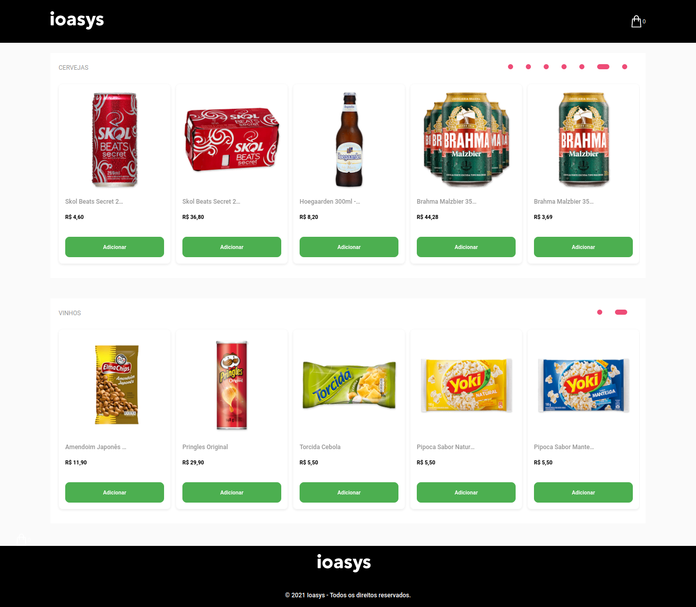

> ## Ioasys Store



> ### Getting Started

```sh
# install dependencies
$ yarn

# runs your application on localhost:3000 and fake api on localhost:3001
$ yarn dev
```

> ### Built with

- Create React App
- Styled Components
- Polished
- JSON Server